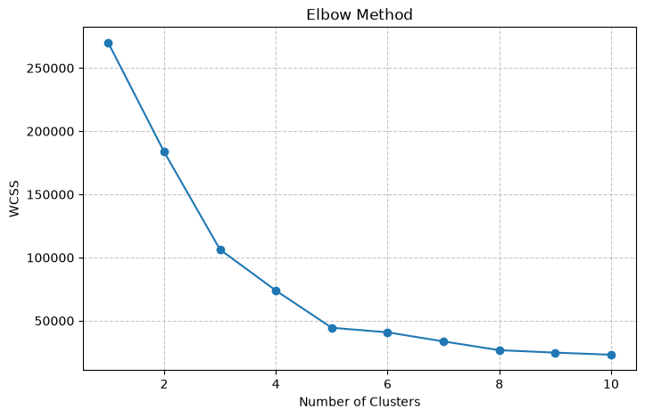
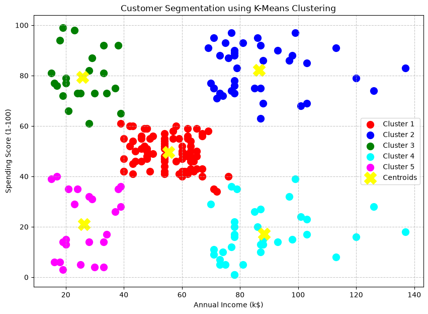

# 🛍️ Customer Segmentation using K-Means Clustering

## 📌 Project Overview

This project applies the **K-Means Clustering Algorithm** to segment mall customers into different groups based on:

- 💰 Annual Income (k$)
- 🛒 Spending Score (1-100)

Customer segmentation helps businesses:

- 🎯 Identify target audiences
- 📈 Improve marketing strategies
- 🤝 Understand customer behavior
- 💡 Make data-driven decisions

---

## 🎯 Objective

The main objectives of this project are:

- ✅ Analyze customer spending behavior
- ✅ Discover hidden customer segments
- ✅ Visualize customer groups using clustering
- ✅ Determine the optimal number of clusters using the Elbow Method

---

## 📊 Dataset Information

The dataset contains customer information collected from a shopping mall.

### Features Used

| Feature | Description |
|----------|------------|
| 💰 Annual Income (k$) | Customer's yearly income |
| 🛍️ Spending Score (1-100) | Customer spending behavior score |

These features were selected to identify customers with similar purchasing patterns.

---

## ⚙️ Methodology

### 1️⃣ Data Preparation

- 📥 Imported dataset using Pandas
- 🔍 Selected relevant features
- 🧹 Checked for missing values
- 📊 Prepared data for clustering

---

### 2️⃣ Finding the Optimal Number of Clusters

The **Elbow Method** was used to determine the best value of **K**.

For each value of K (1–10):

- WCSS (Within Cluster Sum of Squares) was calculated
- Results were plotted on a graph
- The elbow point was identified

### 📈 Elbow Method Result

- ✅ Optimal Number of Clusters = **5**
- ✅ Evaluation Metric = **WCSS**

---

## 📊 Elbow Method Visualization

---

### 3️⃣ K-Means Clustering

After selecting **K = 5**:

- 🤖 Trained the K-Means model
- 👥 Assigned customers to clusters
- 📍 Calculated cluster centroids
- 📈 Visualized customer groups

---

## 🔍 Cluster Analysis

The model identified **5 unique customer segments**:

### 🟢 Cluster 1
- Medium Income
- Medium Spending Score

### 🔵 Cluster 2
- High Income
- High Spending Score
- 🌟 Premium Customers

### 🟡 Cluster 3
- Low Income
- High Spending Score
- 🛒 Frequent Shoppers

### 🟠 Cluster 4
- High Income
- Low Spending Score
- 💰 Conservative Spenders

### 🔴 Cluster 5
- Low Income
- Low Spending Score
- 💵 Budget-Conscious Customers

---

## 📉 Customer Segmentation Visualization

The scatter plot displays:

- 🎨 Different colors representing customer groups
- 📍 Yellow markers representing cluster centroids
- 📊 Clear separation between segments

### Customer Segmentation Result

---

## 🛠️ Technologies Used

- 🐍 Python
- 🐼 Pandas
- 🔢 NumPy
- 📊 Matplotlib
- 🤖 Scikit-Learn

---

## 🚀 How to Run

### Install Dependencies

pip install pandas numpy matplotlib scikit-learn

### Run the Project

python main.py

---

## 🔄 Project Workflow

Dataset  
↓  
Data Preprocessing  
↓  
Feature Selection  
↓  
Elbow Method  
↓  
Optimal K Selection  
↓  
K-Means Clustering  
↓  
Visualization  
↓  
Customer Insights  

---

## 🎉 Outcome

This project successfully segmented customers into **five meaningful groups** using the **K-Means Clustering Algorithm**.

The resulting clusters provide valuable insights that can help businesses:

- 📈 Improve marketing campaigns
- 🎯 Target the right customers
- 💡 Understand customer behavior
- 🤝 Increase customer engagement

---

## 💼 Internship Task

### 🏢 Prodigy InfoTech – Machine Learning Internship

**Task 02**

Create a **K-Means Clustering Model** to group customers based on their purchasing behavior and spending patterns.

---

⭐ If you found this project useful, consider giving it a star!
